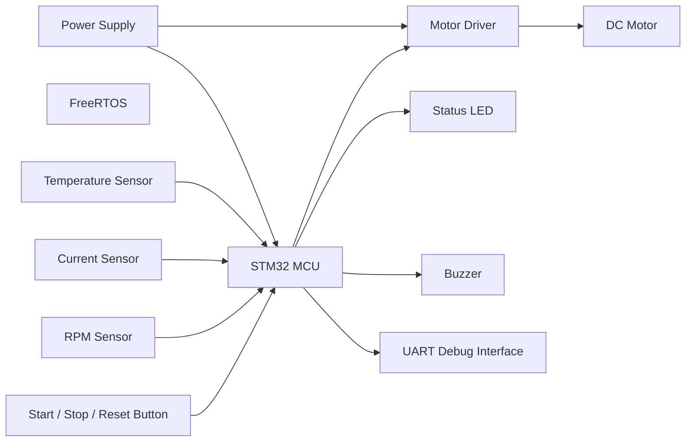

# STM32 & FreeRTOS Based Equipment Monitoring and Protection Control System

## 1. Hardware 개요

MonCon v1.0의 하드웨어 구성과 각 부품의 역할을 정의한다.

본 시스템은 DC Motor 기반 소형 회전 장비를 제어 대상으로 하며, 온도·전류·RPM을 측정하여 장비 상태를 모니터링한다.

비정상 상태가 감지되면 MCU가 보호 로직에 따라 Motor PWM을 차단하고 LED, Buzzer, UART를 통해 상태를 알린다.

## 2. 시스템 다이어그램

## 3. Hardware 상세 부품

### 3.1 MCU Board

역할:

- 전체 시스템 제어
- 센서 데이터 수집
    - Temperature Sensor
    - Current Sensor
    - RPM Sensor Pulse
- 시스템 상태 판정
- Motor PWM 생성
- 보호 동작 수행
- Debugging 및 Monitoring
- FreeRTOS 실행

고려사항:

- STM32 계열
- 충분한 GPIO(Button, Sensor, LED, Buzzer)
- ADC 채널 1개 이상(Current Sensor)
- Timer / PWM 지원(DC Motor)
- Timer Input Capture 지원(RPM Sensor)
- UART 2개 이상
    - Debugging / Monitoring
    - 향후 Communication Module
- I2C(Temperature Sensor)
- SPI 지원 권장(향후 확장)
- External Interrupt(Button, RPM Sensor)
- FreeRTOS 사용 가능 여부
- FreeRTOS 구동에 충분한 Flash / SRAM
- On-board Debugger 권장
- USB를 통한 Programming / Debugging 지원 권장
- Virtual COM Port 지원 권장
- 추가 GPIO Pin 및 Peripheral 여유
- 향후 외부 Communication Module 연결 가능
- 향후 추가 FreeRTOS Task를 고려한 Flash / SRAM 여유

선정 부품:

- TBD

### 3.2 DC Motor

역할:

- 실제 현장 회전 장비를 대체하는 피제어 객체
- Monitoring 및 Protection Control 대상
- 정상 / 비정상 운전 상태 재현

고려사항:

- Rated Voltage
- Rated Current
- Stall Current
- Rated RPM
- No-load RPM
- PWM 기반 속도 제어 가능성
- 부하 특성
- 인위적 부하 적용 가능성
- RPM 측정 가능성
- 축 형태 및 센서 장착 가능성
- Motor Driver와의 전압 / 전류 호환성
- 발열 특성
- 기동 전류
- 구매성과 가격

후보:

| 항목                        | [후보 A](https://www.devicemart.co.kr/goods/view?no=1324874) | [후보 B](https://www.devicemart.co.kr/goods/view?no=1321200) | [후보 C](https://www.devicemart.co.kr/goods/view?no=12536421) | [후보 D](https://www.devicemart.co.kr/goods/view?no=12499172) | [후보 E](https://www.devicemart.co.kr/goods/view?no=15856397) |
|-----------------------------|----------------:|-------------------:|------------------------:|---------------------:|----------------------------:|
| Manufacturer                | Pololu          | DFROBOT            | Pololu                  | Pololu               | Pololu                      |
| Type                        | HPCB 12V        | Metal DC Gearmotor | Brushed DC Gearmotor    | Brushed DC Gearmotor | LP 12V Brushed DC Gearmotor |
| Rated Voltage               | 12 V            | 12 V               | 12 V                    | 12 V                 | 12 V                        |
| Gear Ratio                  | 297.92:1        | 50:1               | 10:1                    | 102.08:1             | 46.85:1                     |
| Specified Power             | -               | 5.0 W              | -                       | -                    | -                           |
| Max Power                   | 1.0 W           | -                  | 12 W                    | 8 W                  | 1.4 W                       |
| No-load RPM                 | 110 RPM         | 100 RPM            | 1000 RPM                | 100 RPM              | **120 RPM**                 |
| No-load Current             | **0.08 A**      | 0.17 A             | 0.2 A                   | 0.15 A               | **0.05 A**                  |
| Rated Speed                 | -               | 93 RPM             | -                       | -                    | -                           |
| Rated Current               | -               | 0.68 A             | -                       | -                    | -                           |
| Rated Torque                | -               | 7 kg·cm            | -                       | -                    | -                           |
| Maximum Efficiency Speed    | 87 RPM          | -                  | 850 RPM                 | 87 RPM               | **99 RPM**                  |
| Maximum Efficiency Current  | 0.21 A          | -                  | 0.91 A                  | 0.72 A               | **0.16 A**                  |
| Maximum Efficiency Torque   | 0.73 kg·cm      | -                  | 0.66 kg·cm              | **4.2 kg·cm**        | 0.73 kg·cm                  |
| Maximum Efficiency Output   | 0.65 W          | -                  | **5.7 W**               | 3.8 W                | 0.74 W                      |
| Stall Current               | **0.75 A**      | 2.19 A             | 5.5 A                   | 5.5 A                | **0.90 A**                  |
| Stall Torque                | 3.3 kg·cm       | 12 kg·cm           | 4.9 kg·cm               | **34 kg·cm**         | 4.8 kg·cm                   |
| Shaft                       | 3 mm D-shaft    | 6 mm D-shaft       | 6 mm D-shaft            | 6 mm D-shaft         | 4 mm D-shaft                |
| Encoder                     | **N**           | -                  | Y                       | Y                    | **N**                       |
| 부하 적용 용이성            | Y               | Y                  | Y                       | Y                    | Y                           |
| Size                        | 10 * 12 * 26 mm | -                  | -                       | 37D * 72.5L mm       | **25D * 52L mm**            |
| Weight                      | **9.5 g**       | 210 g              | 190 g                   | 210 g                | 88 g                        |
| Datasheet                   | Y               | N                  | Y                       | Y                    | Y                           |
| 가격                        | 48,400 ₩        | 21,300 ₩           | 107,360 ₩               | 107,360 ₩            | 52,800 ₩                    |

선정 부품:

- [Pololu] 47:1 Metal Gearmotor 25Dx52L mm LP 12V #3253(후보E)

선정 이유:
- 낮은 전류 요구량
    - No-load Current 0.05 A, Stall Current 0.90 A
    - MonCon의 목적은 Monitoring과 Protection Control이기에 높은 전류의 부품이 불필요
- Monitoring에 적절한 RPM
    - No-load RPM이 120 RPM으로 회전 및 부하에 따른 RPM 변화 관찰에 용이
- 적절한 Motor 및 Shaft 크기
    - 인위적인 부하 적용 및 향후 RPM 측정 구조 구성에 용이
- 성능 대비 가격
    - 상세 Datasheet 및 Performance Data 제공
    - MonCon에 필요한 성능은 만족을 하면서도 후보 C, D 대비 저렴
- Encoder 미내장
    - Encoder가 내장되어 있으면 RPM을 단순하게 처리 가능
    - 별도의 RPM Sensor를 통해 Motor 회전 검출 필요
    - Sensor 출력 Pulse 처리 및 RPM 계산 과정 직접 구현
    - RPM 측정 Hardware와 Firmware의 전체 과정 학습 가능
- 적절한 Torque
    - Maximum Efficiency Torque 0.73 kg·cm, Stall Torque 4.8 kg·cm
    - 인위적인 부하를 적용하여 Current 증가 + RPM 감소를 재현 가능
    - 후보 D의 34 kg·cm와 같은 높은 Stall Torque가 불필요
    - MonCon의 목적이 Motor 출력 자체가 아니라 부하 변화에 따른 상태 Monitoring과 Protection Control이므로 적절

### 3.3 Motor Driver

역할:

- MCU의 PWM 신호를 이용한 DC Motor 구동
- MCU의 저전력 제어 신호를 Motor 구동 전력으로 변환
- PWM 기반 Motor 속도 제어
- FAULT 발생 시 MCU 제어에 따른 Motor 정지

DC Motor 기준 요구사항:

- Motor Rated Voltage : 12 V
- Motor No-load Current : 0.05 A
- Motor Stall Current : 0.90 A
- Motor Supply Voltage 12 V 지원
- Motor Stall Current 0.90 A 대응
- PWM 기반 Motor 속도 제어 지원
- 단방향 Motor 구동 가능
- FAULT 발생 시 Motor 출력 차단 가능

고려사항:

- Motor Supply Voltage Range
- Continuous Output Current
- Peak Output Current 및 허용 시간
- PWM 제어 지원
- PWM Frequency Range
- Enable / Disable 기능
- Brake 기능
- MCU Logic Voltage 호환성
- Voltage Drop / RDS(on)
- Current Regulation 및 Current Limit 기능
- Overcurrent Protection
- Overtemperature Protection
- Undervoltage Lockout
- Reverse Polarity Protection
- 역기전력 처리 방식
- 발열 및 방열 요구사항
- Channel 수
- Driver IC / Module 형태
- 크기 및 무게
- Datasheet 유무
- 구매성 및 가격

후보:

| 항목 | [후보 A](https://www.devicemart.co.kr/goods/view?no=13179162) | [후보 B](https://www.devicemart.co.kr/goods/view?no=1280280) | [후보 C](https://www.devicemart.co.kr/goods/view?no=1321186) | [후보 D](https://www.devicemart.co.kr/goods/view?no=1266117) |
|--------------------------------|--------------------------------------------:|--------------------------------------------------:|-------------------------------------------------------------:|------------:|
| Manufacturer                   | Cytron                                      | Cytron                                            | Adafruit / TI                                                | NURIROBOT   |
| Model                          | MDD20A                                      | MDD10A                                            | DRV8871 Breakout                                             | DDA3502P    |
| Motor Type                     | Brushed DC                                  | Brushed DC                                        | Brushed DC                                                   | DC Motor    |
| Channel                        | 2                                           | 2                                                 | **1**                                                        | **1**       |
| Motor Supply Voltage Range     | 6 ~ 30 V                                    | 5 ~ 30 V                                          | 6.5 ~ 45 V                                                   | 8 ~ 35 V    |
| Continuous Output Current      | 20 A / Channel                              | 10 A / Channel @ 25°C                             | **조건 의존 (2 A RMS @ 25°C 구동 사례)**                     | **2 A**     |
| Peak Output Current            | 60 A / Channel                              | 30 A / Channel                                    | **3.6 A**                                                    | 7.5 A       |
| Peak Current 허용 시간         | Board Temperature에 따라 제한               | ≤ 10 s                                            | -                                                            | -           |
| PWM 제어                       | Y                                           | Y                                                 | Y                                                            | Y           |
| PWM Frequency                  | DC ~ 20 kHz                                 | Max 20 kHz                                        | **0 ~ 200 kHz**                                              | 20 kHz 권장 |
| Extended PWM Frequency         | **20 ~ 40 kHz**                             | -                                                 | -                                                            | -           |
| Enable / Disable Pin           | N                                           | N                                                 | N                                                            | N           |
| Brake                          | Y                                           | Y                                                 | Y                                                            | Y           |
| 별도 Brake Input               | N                                           | N                                                 | N                                                            | **Y**       |
| Direction Control              | Y                                           | Y                                                 | Y                                                            | Y           |
| Logic Input LOW                | 0 ~ 0.8 V                                   | 0 ~ 0.5 V                                         | ≤ 0.5 V                                                      | 0 V         |
| Logic Input HIGH               | **1.5 ~ 15 V**                              | 3 ~ 5.5 V                                         | **≥ 1.5 V**                                                  | 3 ~ 75 V    |
| 3.3 V Logic 호환성             | Y                                           | Y                                                 | Y                                                            | Y           |
| Voltage Drop                   | -                                           | -                                                 | -                                                            | -           |
| RDS(on)                        | -                                           | -                                                 | 565 mΩ typ. (HS + LS)                                        | -           |
| Current Regulation             | -                                           | -                                                 | **Y**                                                        | -           |
| Current Limit 설정             | -                                           | -                                                 | **Y (RILIM)**                                                | -           |
| Overcurrent Protection         | **Y**                                       | -                                                 | **Y**                                                        | **Y**       |
| Overtemperature Protection     | **Y**                                       | -                                                 | **Y (TSD)**                                                  | -           |
| Undervoltage Lockout           | **Y**                                       | -                                                 | **Y (UVLO)**                                                 | -           |
| Automatic Fault Recovery       | -                                           | -                                                 | **Y**                                                        | -           |
| Reverse Polarity Protection    | N                                           | -                                                 | -                                                            | -           |
| 역기전력 / Inductive Load 처리 | -                                           | Regenerative Current 고려 필요                    | -                                                            | -           |
| 발열 / 방열 조건               | Board Temperature에 따라 Current Limit 변동 | 25°C 기준 Continuous 사양 / 별도 Heat Sink 불필요 | **PCB / Ambient Temperature에 따라 Continuous Current 변동** | -           |
| Driver 형태                    | Module                                      | Module                                            | **Breakout Board**                                           | **Module**  |
| Size                           | 약 78.74 × 88.90 mm                         | 약 84.5 × 62 mm                                   | -                                                            | 50 × 50 mm  |
| Weight                         | -                                           | -                                                 | -                                                            | 49 g        |
| 구매 가격                      | 63,580 ₩                                    | 39,930 ₩                                          | 15,070 ₩                                                     | 41,800 ₩    |

선정 부품:

- [Adafruit] Adafruit DRV8871 DC Motor Driver Breakout Board - 3.6A Max [ada-3190](후보 C)

선정 이유:
- 선정 Motor의 Rated Voltage와 호환
    - Motor Rated Voltage 12 V
    - Driver Motor Supply Voltage Range 6.5 ~ 45 V
- 선정 Motor의 Stall Current 대응 가능
    - Motor Stall Current 0.90 A
    - Driver Peak Output Current 3.6 A
- 1 Channel로 충분
- PWM 기반 Motor 제어 가능
- Current Regulation 및 RILIM 기반 Current Limit 설정 지원
- OCP, TSD, UVLO 등 Motor Protection 기능 제공
- 적절한 출력 전류 범위
    - Peak Output Current 3.6 A로 Motor Stall Current 0.90 A 대응 가능
    - 후보 A, B의 60 A, 30 A Peak Output Current는 선정 Motor에 과도
- 3.3 V Logic 호환
    - Logic Input HIGH ≥ 1.5 V
    - 향후 STM32의 3.3 V GPIO를 통한 직접 제어 가능
- 후보 중 가장 낮은 가격
    - 구매 가격 15,070 ₩

## 4. Sensors

### 4.1 Temperature Sensor

역할:

- Motor 또는 장비 주변 온도 측정
- 과열 상태 감지

MCU Interface:

- TBD

고려사항:

- 측정 범위
- 정확도
- 응답 속도
- Interface
- MCU와의 전압 호환성
- 장착 방식

선정 부품:

- TBD

### 4.2 Current Sensor

역할:

- Motor 소비 전류 측정
- 과부하 및 과전류 상태 감지

MCU Interface:

- ADC 또는 Digital Interface

고려사항:

- 측정 가능한 전류 범위
- Motor Stall Current 측정 가능 여부
- 출력 형식
- 정확도
- 절연 필요 여부
- ADC 입력 전압 범위

선정 부품:

- TBD

### 4.3 RPM Sensor

역할:

- Motor 회전 속도 측정
- 저속, 정지 및 비정상 RPM 상태 감지

MCU Interface:

- GPIO / External Interrupt / Timer Input Capture

고려사항:

- 측정 방식
- Pulse per Revolution
- 최대 측정 RPM
- 센서 장착 난이도
- Timer와의 연동성

선정 부품:

- TBD

## 5. User Interface

### 5.1 Status LED

역할:

- 시스템 상태 표시

예시:

- NORMAL
- WARNING
- FAULT

구체적인 표시 방식은 추후 결정한다.

### 5.2 Buzzer

역할:

- WARNING 또는 FAULT 발생 시 사용자에게 알림

선정 부품:

- TBD

### 5.3 Buttons

역할:

- Motor Start
- Motor Stop
- Fault Reset

버튼 구성 방식은 추후 결정한다.

## 6. Debug Interface

### UART

역할:

- 센서값 출력
- 시스템 상태 출력
- Fault Reason 출력
- 개발 중 Debugging

필요 기능:

- USB-UART 또는 MCU Board의 Virtual COM Port 사용

구체적인 구성은 MCU Board 선정 후 결정한다.

## 7. Power Architecture

시스템에서 필요한 전원 구성을 정의한다.

예상 전원 영역:

- MCU Logic Power
- Sensor Power
- Motor Power
- Motor Driver Power

확인해야 할 사항:

- MCU 동작 전압
- Sensor 동작 전압
- Motor 정격 전압
- Motor Driver 입력 전압
- 전체 최대 소비 전류
- Motor Noise가 MCU 전원에 미치는 영향
- Ground 구성

구체적인 전원 구성은 MCU Board와 Sensor를 포함한 전체 Hardware 선정 후 결정한다.

## 8. MCU Peripheral Mapping

최종 부품 선정 후 실제 MCU Peripheral 연결을 기록한다.

| 기능                | Peripheral                 | 연결 대상          | 상태 |
|---------------------|----------------------------|--------------------|------|
| Status LED          | GPIO Output                | LED                | TBD  |
| Buzzer              | GPIO Output / PWM          | Buzzer             | TBD  |
| Button              | GPIO Input                 | Button             | TBD  |
| RPM                 | Timer / External Interrupt | RPM Sensor         | TBD  |
| Motor Control       | PWM                        | Motor Driver       | TBD  |
| Current Measurement | ADC                        | Current Sensor     | TBD  |
| Debug               | UART                       | PC                 | TBD  |
| Temperature         | I2C / 기타                 | Temperature Sensor | TBD  |

## 9. Hardware Protection

최소한 다음 항목을 고려한다.

- Motor 역기전력
- 과전류
- Reverse Polarity
- 전원 노이즈
- MCU와 Motor 전원 분리 여부
- Decoupling Capacitor
- Ground 구성

구체적인 보호 회로는 부품 선정 후 설계한다.

## 10. Bill of Materials

최종 부품 선정 후 작성한다.

| Category           | Component | Quantity | Purpose                |
|--------------------|-----------|----------|------------------------|
| MCU                | TBD       | 1        | Main Controller        |
| Motor              | Pololu #3253       | 1        | Controlled Equipment   |
| Motor Driver       | Adafruit DRV8871 Breakout [ada-3190]       | 1        | Motor Drive            |
| Temperature Sensor | TBD       | 1        | Temperature Monitoring |
| Current Sensor     | TBD       | 1        | Current Monitoring     |
| RPM Sensor         | TBD       | 1        | Speed Monitoring       |
| LED                | TBD       | TBD      | Status Indication      |
| Buzzer             | TBD       | 1        | Alarm                  |
| Button             | TBD       | TBD      | User Input             |
| Power Supply       | TBD       | TBD      | System Power           |

## 11. Hardware Selection Status

| Component          | Status       |
|--------------------|--------------|
| MCU Board          | Not Selected |
| DC Motor           | Selected |
| Motor Driver       | Selected |
| Temperature Sensor | Not Selected |
| Current Sensor     | Not Selected |
| RPM Sensor         | Not Selected |
| Power Supply       | Not Selected |
| LED                | Not Selected |
| Buzzer             | Not Selected |
| Button             | Not Selected |