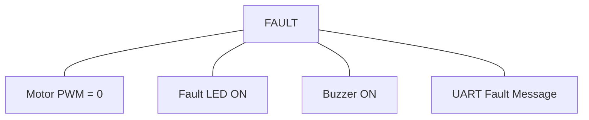

# STM32 & FreeRTOS Based Equipment Monitoring and Protection Control System

## 1. **프로젝트 목적**

DC Motor 기반 소형 회전 장비의 상태를 여러 센서로 모니터링하고, MCU가 정상/경고/고장 상태를 판정하여 모터와 경고 장치를 제어한다. 최종 시스템은 FreeRTOS 기반으로 동작하며, 추후 센서와 액추에이터를 쉽게 추가할 수 있는 구조를 목표로 한다.

## 2. **v1.0 시스템 구성**

| 구분            | 구성                         |
|-----------------|------------------------------|
| MCU             | STM32 계열 보드              |
| RTOS            | FreeRTOS                     |
| 제어 대상       | DC Motor                     |
| 센서 1          | Temperature Sensor           |
| 센서 2          | Current Sensor               |
| 센서 3          | RPM Sensor                   |
| 출력 1          | DC Motor PWM 제어            |
| 출력 2          | 상태 LED                     |
| 출력 3          | Buzzer                       |
| 사용자 입력     | Start/Stop 또는 Reset Button |
| 디버깅/모니터링 | UART Serial Log              |

## 3. **시스템 상태**

 ```mermaid
flowchart TD
    STOPPED -->|동작| NORMAL
    NORMAL -->|이상 징후| WARNING
    NORMAL -->|Critical| FAULT
    WARNING -->|정상 복귀| NORMAL
    WARNING -->|위험 임계값 초과| FAULT
    FAULT -->|Reset & Safe Condition 만족| STOPPED
```

| 상태    | 의미                           |
|---------|--------------------------------|
| STOPPED | 사용자가 정지시킨 상태         |
| NORMAL  | 모든 측정값이 정상 범위        |
| WARNING | 일부 측정값이 경고 범위        |
| FAULT   | 장비 보호가 필요한 비정상 상태 |

## 4. **센서별 기본 기능**

실제 임계값은 측정 후 결정

Temperature

- 장비 또는 모터 주변 온도 측정
- WARNING 임계값 판정
- Critical 임계값 판정
        
```
[예시]
NORMAL  : temp < warningThreshold
WARNING : warningThreshold <= temp < criticalThreshold
FAULT   : temp >= criticalThreshold
```


Current

- 모터 소비 전류를 측정
    
```
[예시]
정상 전류       → NORMAL
높은 전류       → WARNING
과전류          → FAULT
```

RPM

- 모터 회전 속도를 측정

 ```
[예시]
Target RPM = 2000
1800 ~ 2200 RPM → NORMAL
1500 ~ 1800 RPM → WARNING
< 1500 RPM      → FAULT 후보
```

## 5. **보호 동작**

FAULT 발생 시 시스템은 최소한 다음 동작을 수행

FAULT 상태에서는 자동으로 모터가 다시 작동하지 않도록 하고, 사용자의 Reset 입력 이후 조건이 정상일 때만 복구

FAULT 원인
- OVER_TEMPERATURE
- OVER_CURRENT
- ABNORMAL_RPM
- SENSOR_FAILURE

## 6. **기본 제어 기능**

```
Start
  ↓
Motor PWM 출력
  ↓
Motor 회전
  ↓
센서 모니터링
  ↓
상태 판정
  ↓
필요 시 보호 동작
 ```

## 7. **Bare-metal 구조**

- FreeRTOS 구현 이전에 Bare-metal 구조로 구현
- MCU peripheral과 센서 제어를 학습

## 8. **UART 모니터링 예시**

정상 상태:
```
[10:32:01]
STATE : NORMAL
TEMP  : 35.2 C
CURR  : 0.34 A
RPM   : 2050
PWM   : 60 %
```
주의:
```
[10:32:08]
STATE : WARNING
TEMP  : 58.1 C
CURR  : 0.71 A
RPM   : 1680
```
위험:
```
[10:32:15]
STATE  : FAULT
REASON : OVER_CURRENT
MOTOR  : STOPPED
```

## 9. **목표**

*Hardware*
| Peripheral         | 용도                    |
| ------------------ | ----------------------- |
| GPIO Output        | LED, Buzzer             |
| GPIO Input         | Button                  |
| External Interrupt | Button 또는 RPM 입력    |
| Timer              | 주기 처리/RPM           |
| PWM                | Motor 속도 제어         |
| ADC                | Current Sensor          |
| UART               | Debug Log               |
| I2C                | Temperature Sensor 사용 시     |

*Develop*
    
필수:
- Task
- Queue
- Task Priority
- Delay / Periodic Execution

부가:
- Mutex
- Semaphore
- Event Group
- Software Timer

## 10. **v1.0 완료 조건**

- Temperature, Current, RPM 데이터 정상 측정
- DC Motor PWM 제어 가능
- NORMAL / WARNING / FAULT 상태 판정 가능
- 과열에 의한 WARNING / FAULT 발생 가능
- 과전류에 의한 WARNING / FAULT 발생 가능
- RPM 이상에 의한 WARNING / FAULT 발생 가능
- FAULT 발생 시 Motor PWM 즉시 차단
- FAULT 원인을 식별할 수 있음
- FAULT 상태에서 자동 재가동하지 않음
- Reset 및 Safe Condition 확인 후 재가동 가능
- UART를 통해 센서값 / 시스템 상태 / Fault 원인 확인 가능
- Bare-metal 버전 구현 완료
- FreeRTOS 기반 최종 버전 구현 완료
- 기본 정상/비정상 시나리오 테스트 완료